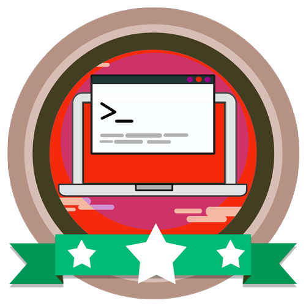

<!-- Badges session -->

  <!-- languages -->
  
  <!-- repo size -->
  
  <!-- last commit -->
  
  <!-- licence MIT -->
  

<!--Banner session-->

  

<!--About session-->
<h1 align="center">Construindo um projeto de uma API.NET integrada ao MongoDB Digital Innovation One</h1>

Curso do Bootcamp Avanade Full-stack Developer da [Digital Innovation One](https://digitalinnovation.one/).

Construiremos um projeto de uma API em .NET Core integrada a um cluster MongoDB, que também criaremos em tempo real no service cloud Mongo Atlas. Vamos repassar brevemente os conceitos básicos de front-end, back-end, bases de dados, NoSQL e MongoDB para fixar o entendimento e sua aplicabilidade.

<h3>👨‍💻 Tecnologias utilizadas</h3>

- [.NET Core](https://dotnet.microsoft.com/download)
- [MongoDB](https://www.mongodb.com/cloud/atlas/register)
- [Postman](https://www.postman.com/downloads/)

<!--License session-->
<h3>📝 Licença</h3>

- Este projeto está sob a licença [MIT](./LICENSE).

<!--Bottom session-->
 <h4 align=center>Made with by <a target="_blank" href="https://pleiterson.vercel.app" >Pleiterson Amorim</a></h4>
